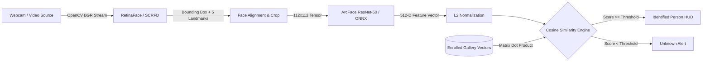

# 👁️ NeuroFace Studio (FaceID AI)
### Next-Gen Real-Time Biometric Face Recognition & Identity Verification Suite

[](https://www.python.org/)
[](https://github.com/deepinsight/insightface)
[](https://onnxruntime.ai/)
[](https://opencv.org/)
[](https://github.com/TomSchimansky/CustomTkinter)
[](LICENSE)

---

## ⚡ Overview

**NeuroFace Studio** is an ultra-fast, high-precision biometric identity authentication and face recognition desktop suite built for security checkpoints, smart attendance, access control kiosks, and surveillance systems. 

Powered by deep convolutional neural networks (**InsightFace ArcFace**) and accelerated via **ONNX Runtime**, it delivers millisecond-level face localization, 512-dimensional normalized biometric feature vector extraction, and cosine similarity matching at **30+ FPS**.

---

## ✨ Key Features

- **🎯 State-of-the-Art ArcFace Embeddings**: Uses deep metric learning (Additive Angular Margin Loss) to generate 512-D L2-normalized face embeddings with state-of-the-art (>99.8% LFW) separation accuracy.
- **⚡ Sub-40ms Real-Time Inference**: Thread-isolated video pipeline running decoupled from the UI pump to maintain fluid 30+ FPS live recognition without frame drops.
- **🛡️ Dynamic Similarity Threshold Gating**: Real-time adjustable threshold slider (0.20 - 0.80) to fine-tune False Acceptance Rate (FAR) vs False Rejection Rate (FRR) on the fly.
- **⚡ Signature-Based Embedding Caching**: Employs an mtime & file-count signature cache (`gallery_cache.pkl`) that eliminates cold-start re-encoding, loading hundreds of enrolled identities in under 100ms.
- **📸 1-Click Enrollment & Burst Capture**:
  - Live webcam snapshot burst mode (captures multiple angles in seconds).
  - Bulk image file upload with automatic multi-image embedding averaging.
- **📂 Interactive Gallery Manager**: Real-time thumbnail preview grid, enrolled identity count, and individual/identity deletion tools.
- **🖥️ Cyberpunk / Industrial Dark HUD**: Designed with CustomTkinter for high visual polish, complete with live telemetry cards (FPS, Active Faces, Identified Count, System Status).

---

## 🏗️ Architecture & Pipeline



---

## 📊 Benchmark & Comparison

| Feature | Haar Cascades | Dlib HOG / ResNet | **NeuroFace (ArcFace + ONNX)** |
| :--- | :--- | :--- | :--- |
| **Accuracy (LFW)** | ~70% | ~99.38% | **99.83%+** |
| **Angle / Pose Invariance** | Very Poor | Moderate | **High (up to ±60° yaw/pitch)** |
| **Inference Latency** | 10ms | 120ms (CPU) | **~25-35ms (ONNX CPU/GPU)** |
| **Embedding Dimension** | N/A | 128-D | **512-D Dense Vectors** |
| **Multi-Face Concurrency** | Poor | Slow | **Real-Time Parallel** |

---

## 🚀 Quick Start Guide

### 1. Prerequisites
- Python 3.10 or 3.11 recommended.
- Webcam / USB Camera.
- (Optional) NVIDIA GPU with CUDA for ONNX GPU acceleration.

### 2. Clone Repository
```bash
git clone https://github.com/<your-username>/neuroface-studio.git
cd neuroface-studio
```

### 3. Create Virtual Environment & Install Dependencies
```bash
# Windows (PowerShell)
python -m venv venv
.\venv\Scripts\Activate.ps1

# Install requirements
pip install -r requirements.txt
```

### 4. Launch NeuroFace Studio
```bash
python face_gui.py
```

### 5. First-Time Walkthrough
1. Click **⚡ Load Model** on the sidebar (downloads `buffalo_l` ONNX models on first run).
2. Go to **➕ Enroll Faces**, enter a name, start capture, and click **📸 Snap** (take 3–5 angles).
3. Click **🔨 Build Gallery** to compute and cache the biometric embeddings.
4. Go to **📡 Live Recognition** and click **▶ Start Camera** for real-time identification!

---

## 📁 Repository Structure

```
├── face_gui.py           # Core GUI Application & Face Recognition Pipeline
├── requirements.txt      # Python dependencies (OpenCV, InsightFace, ONNX, CustomTkinter)
├── gallery/              # Enrolled identity storage (auto-created)
│   └── .gitkeep          # Directory placeholder
├── .gitignore            # Git exclusion rules (ignores heavy model caches & venv)
└── README.md             # Project documentation
```

---

## 🔮 Hackathon Roadmap & Next Steps

- [ ] **Liveness Detection (Anti-Spoofing)**: Blink & passive texture analysis to prevent 2D photo spoofing attacks.
- [ ] **Edge Deployment**: Quantization (INT8) for Raspberry Pi 5 & Jetson Orin Nano.
- [ ] **WebRTC Cloud Gateway**: Streaming video over WebRTC to a lightweight web dashboard.
- [ ] **Attendance Log Export**: Auto-exporting timestamped logs to CSV / SQLite / REST API.

---

## 📄 License
This project is open-source under the [MIT License](LICENSE).
